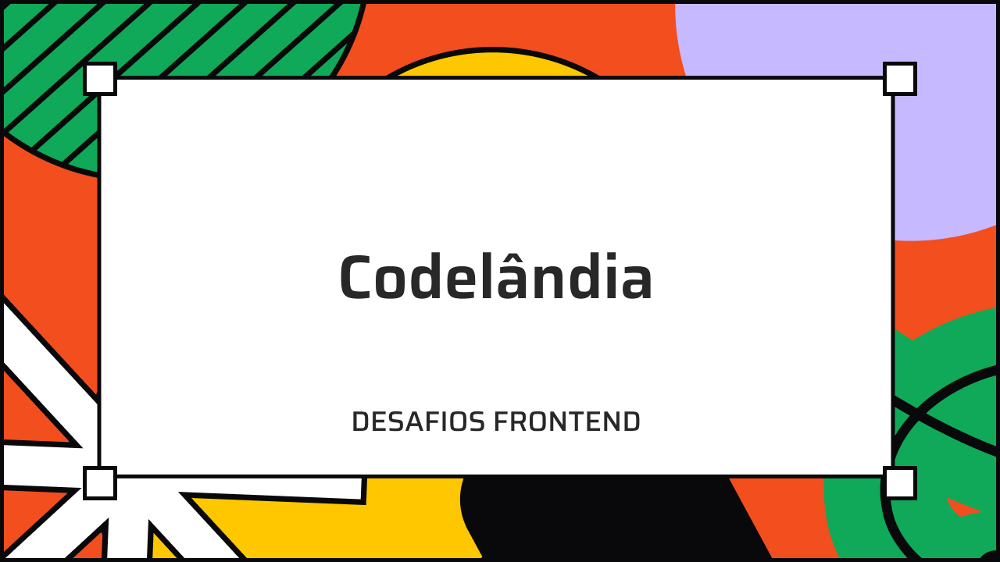

 

  

  <h3 align="center">Codelândia Desafios</h3>

  

    Repositório para centralizar todas as resoluções de desafios proposto na comunidade de Discord Codêlandia do Iuri Silva. Cada projeto terá o link para acesso ao deploy da aplicação, figma com design e detalhes de criação do projeto
 
 
<a href="#indíce-de-projetos"><strong> Explorar os desafios »</strong></a> 
 

  

## Construído Com

Todos os projetos serão construídos utilizando o ReactJS framework Next13, Vite (build tool) e ferramentas Tailwind CSS, React Hook Forms, ZOD, Zustand e muito mais.

## Indíce de Projetos

| Desafio | Nome | Stack |
|---------|------|-------|
| 01 | [Search Text](https://github.com/lucassamuel94/serchtext-codelandia) | Vite, React JS |
| 02 | [Jordan Shoes](https://github.com/lucassamuel94/jordanshoes-codelandia) | Vite, React JS |
| 03 | [One Page](https://github.com/lucassamuel94/desafio-03-one-page-codelandia) | HTML, CSS e JS |
| 04 | [Login](https://github.com/lucassamuel94/login-codelandia) | NextJS e Firebase |
| 05 | [Studio Ghibli](https://github.com/lucassamuel94/desafio-05-studio-ghibli-codelandia) | Vite, React JS |
| 06 | [Loki](https://github.com/lucassamuel94/desafio-06-loki-codelandia) | Vite, React JS |
| 07 | [Loki](https://github.com/lucassamuel94/desafio-07-valorant-codelandia) | Vite, React JS |

## :memo: Licença

Esse projeto está sob a licença MIT. Veja o arquivo [LICENSE](LICENSE) para mais detalhes.

## Autor

- **[Lucas Samuel](https://github.com/lucassamuel94/)** - _Frontend Developer_ -
